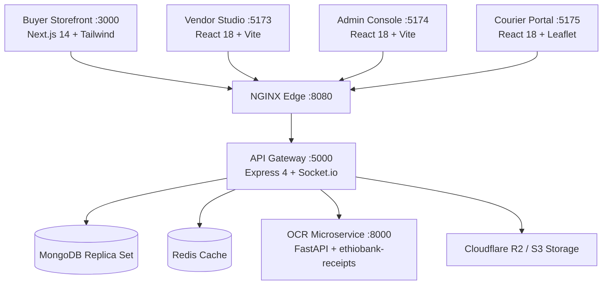
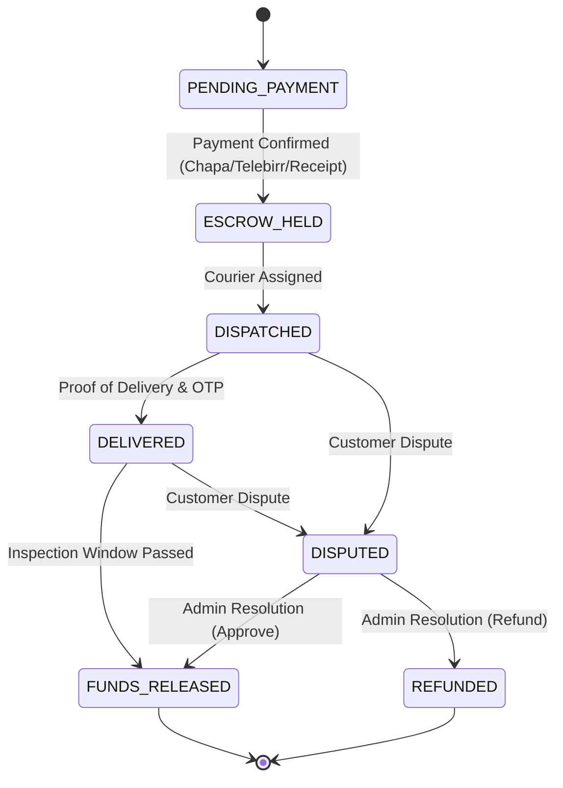

# PALEO System Architecture & Infrastructure

This document details the software architecture, workspace topology, escrow security engine, and deployment topology implemented in the PALEO Curated Marketplace.

---

## 🏗️ Architectural Topology

The platform operates as a modular npm monorepo with dedicated frontends, API gateway, OCR service, and NGINX reverse proxy:

---

## 📦 Workspace Structure

*   **`apps/buyer-storefront`** (Port 3000): Next.js 14 App Router, Server Components, Zustand state, Tailwind CSS, Leaflet hyperlocal maps.
*   **`apps/vendor-dashboard`** (Port 5173): React 18 + Vite studio for verified merchants to manage inventory, payouts, and orders.
*   **`apps/admin-console`** (Port 5174): React 18 + Vite operations console for KYC verification, escrow release, and dispute arbitration.
*   **`apps/courier-web-view`** (Port 5175): React 18 + Leaflet portal with live OSRM routing and turn-by-turn Adama delivery telemetry.
*   **`services/api-gateway`** (Port 5000): Central Node.js/Express gateway providing PBKDF2 authentication, RBAC, escrow state machine, and Socket.io events.
*   **`services/receipt-parser`** (Port 8000): Python FastAPI microservice utilizing Tesseract OCR and `ethiobank-receipts` to validate CBE/Telebirr payment slips.
*   **`deploy/nginx`**: Reverse proxy configs with gzip compression, WebSocket proxying, and rate limiting.

---

## 🔒 Escrow State Machine & Security

The platform enforces strict state transitions for payments and orders:

---

## 🔑 Authentication & Token Lifecycle

*   **Password Storage**: 100,000-round PBKDF2 SHA-512 with cryptographically random per-user salt.
*   **Session Management**: JSON Web Tokens (JWT) with `HttpOnly`, `SameSite=Strict`, and `Secure` cookie options.
*   **Role-Based Access Control**: Strict capability isolation across `buyer`, `vendor`, and `admin` roles.
*   **Webhook Integrity**: HMAC-SHA256 signature verification for Chapa and Telebirr payment webhooks with timing-safe comparison.
